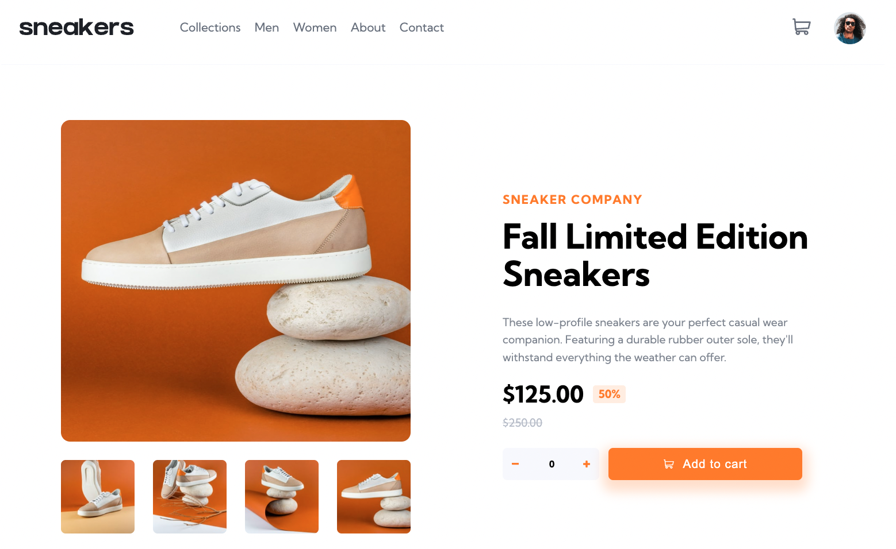
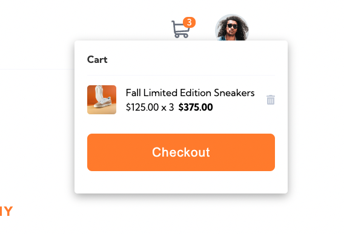
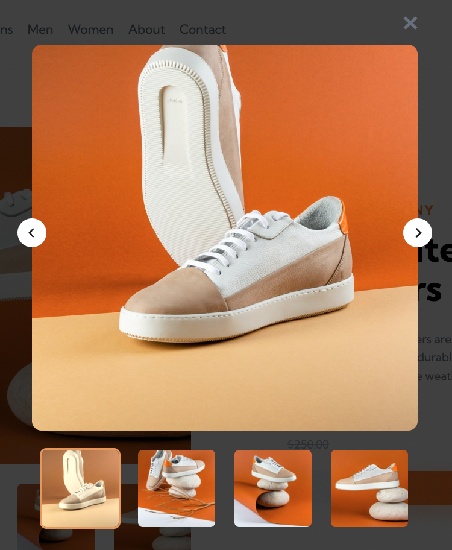
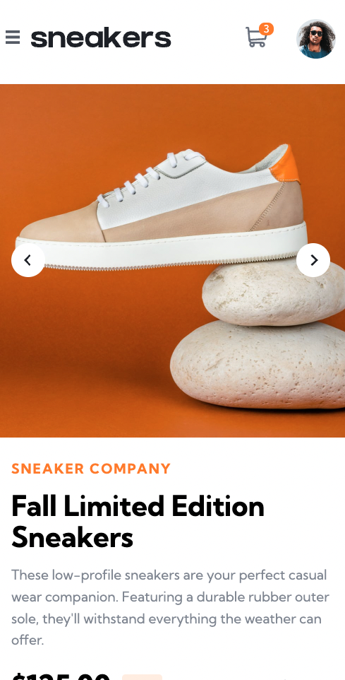
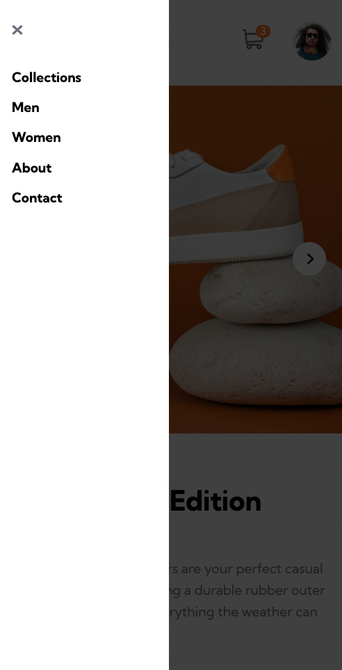

Live Url: https://ecommerce-product-page-webdev-ksb.netlify.app/

# E-commerce Product Page

This is a solution to the [E-commerce product page challenge on Frontend Mentor](https://www.frontendmentor.io/challenges/ecommerce-product-page-UPsZ9MJp6).

## Overview

This is a sample of an e-commerce product page built with React. Features include a dynamic shopping cart and quantity counter, as well as a lightbox for displaying product images in a more front-and-center way.

### Screenshot

### Built with

- [React](https://reactjs.org/) - JS library (using Context)
- Semantic HTML5 markup
- CSS custom properties
- Flexbox
- Mobile-first workflow
